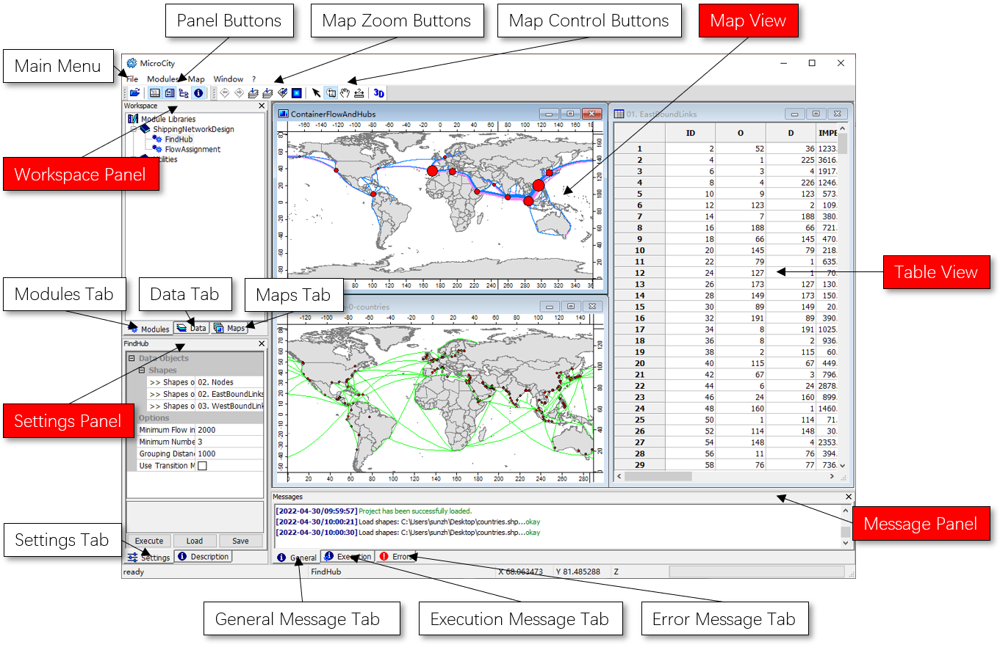

# 3.1 User Interfaces Overview
MicroCity provides a concise graphic windowed interface to facilitate the manipulation of data and modules. 
## The Main Window and Components

## Supported Files
MicroCity can open ArcGIS shapefile (\*.shp), Grids file (\*.sgrd), dBase file (\*.dbf), Tabular text file (\*.csv, \*.txt), Point clouds (\*.spc), Image file (\*.bmp, \*.gif, \*.jpg, \*.png, \*.tif, \*.pcx) and MicroCity 3D Scene (\*.m3d). These data files are maintained in the **Data** Tab of the **Workspace** Panel. Module libraries (\*.dll, \*.mcs) are maintained and executed through the **Modules** Tab of the **Workspace** Panel. 
## Project Management
The information of opened data files, module libraries, settings and sub-windows can be saved or opened in a **MicroCity Project (\*.mprj)** through the menu **File->Project**. The mprj file does not contain any **file's data**. For easy maintenance, files in a project should be put into the same folder or sub-folders of the mprj file.

[**< 2.2 Searching for Countries**](2.2_searching_for_countries.md) | [**Table of Contents**](.) | [**3.2 Vector Shapes >**](3.2_vector_shapes.md)
