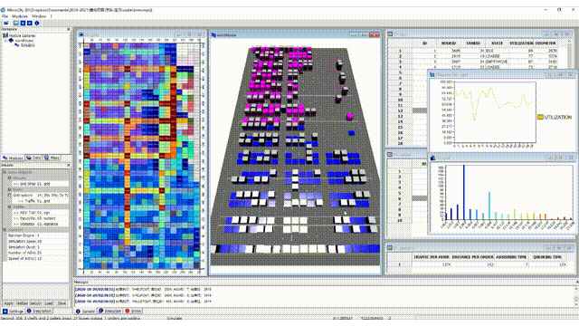
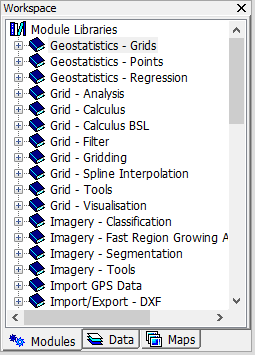

# 1.1 What MicroCity can Do
MicroCity is designed to be a handy spatial planning tool, which is **portable, compact and fast**.
## A Modeling Framework
Based on GIS, Networks and Mixed Integer Programming libraries, MicroCity can be used as a modeling framework to solve transporation problems, such as **City Logistics and Shipping Planning:** 
 &nbsp;&nbsp;  
## A Simulation Platform
Based on 3D CGI and Discrete Event Simulation Engine, MicroCity can be used as a simulation platform to evaluate logistic scenarios, such as **Automated Warehouse Simulation and Container Terminal Simulation:** 
 &nbsp;&nbsp;  
## Modules and Scripting
MicroCity can extend its functionality with modules which uses lua as its scripting language and can be edited and debugged in **Script Editor:** 
  &nbsp;&nbsp;  

Currently, MicroCity is mainly used in teaching and research. It can be freely distributed. 

[**Table of Contents**](.) | [**2.1 Showing a World Map >**](2.1_showing_a_world_map.md)
