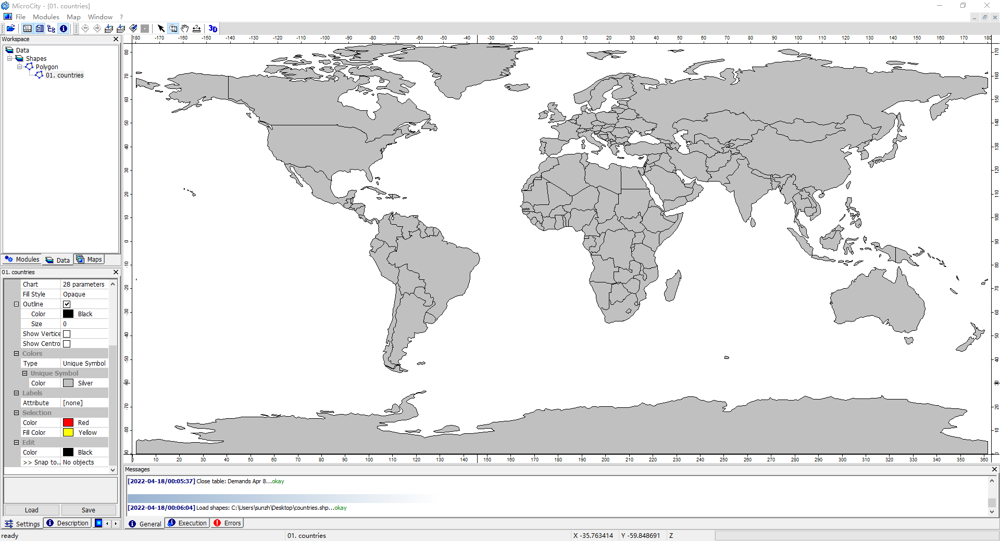
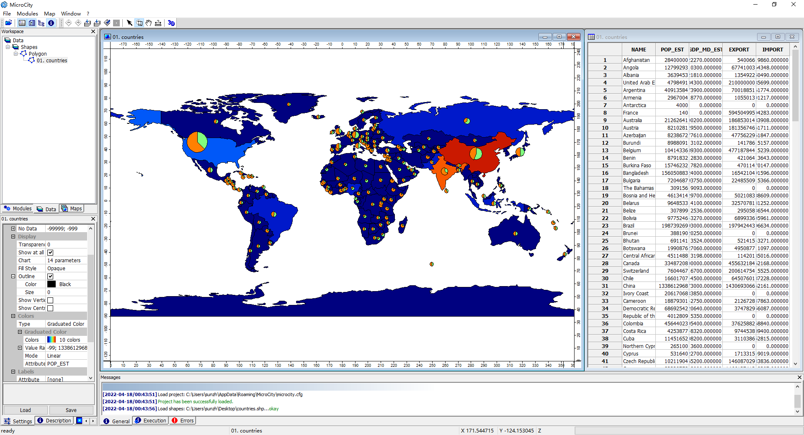

# Showing a World Map
This tutorial will guide you in manipulating and visualizing GIS data in MicroCity.
## 1 Loading data and create a map
**Download** the [countries.shp](https://github.com/microcity/microcity.github.io/raw/main/docs/data/countries.shp) (ArcGIS shapefile) and the [countries.dbf](https://github.com/microcity/microcity.github.io/raw/main/docs/data/countries.dbf) (dBase file) in a same folder. Open or drag the countries.shp into MicroCity and select **Data Tab** in Workspace panel. Double click **Data->Shapes->Polygon->01. countries** in Workspace panel. 

## 2 Visualizing coutries' properties
Right click **Data->Shapes->Polygon->01. countries** in Workspace panel. Click **Attributes->Table->Show** in the popup menu. In Settings Panel, find **Colors->Type** option and select **Graduated Color**. In its sub-option **Attribute**, select POP_EST which is population property of countries. In Setting Panel, find **Chart** option and click the **...** button. In the popup dialog, select **pie** in Chart Type option and select **GDP_MD_EST** in Attribute (Size) option and select **EXPORT** and **IMPORT** checkboxs in Fields option and click **Okay** button.

## 3 Editing shapes
Select **Action** button at toolbar. Left click some country and right click it and select **Edit Selected Shape** in the popup menu. Then the shape will be in editing mode. You can change its polygon points and finish your editing by right click and select **Edit Selected Shape** again.
