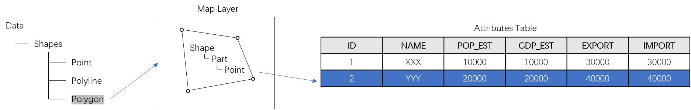
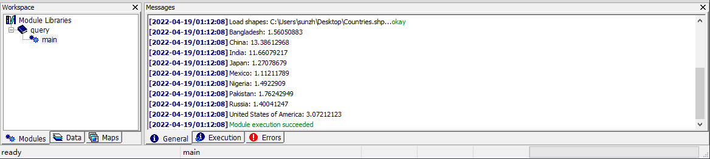

# 2.2 Searching for Countries
This tutorial will guide you in coding with MicroCity Script to manipulate GIS data. You have to complete 2.1 to proceed. 
## GIS Data Structure
In MicroCity, GIS data consists of three types of **Shapes**: Point, Polyline and Polygon, each of which can be visualized as a Map Layer. In a layer, a **Shape** object consists of one or more **Parts**, and every **Part** consists of one or more **Points**. A **Shape** object is also associated to a record in the **Attributes Table**. You can also edit the shape or its attributes (see [3.2](3.2_vector_shapes.md)).

If you want perform a complex editing or handle a batch of shapes, you can use MicroCity Script, in which many built-in functions can be used. 
## Making a Query
Suppose we want to find countries, each of which has a population of more than 100 million and is entirely in the northern hemisphere. So we need to check every point's coordinate in each shape and the population attribute of the shape. Open **ScriptEditor**  and type following codes:
```lua
local Countries = Open("countries.shp")                 --Try to open the shapes layer
for i = 1, GetRecCount(Countries) do                    --Loop all the shape objects in the layer
    local country = GetShape(Countries, i)              --Get the shape object of a country
    local north = true                                  --Assume the country is in the northern hemisphere
    for j = 1, GetPartCount(country) do                 --Loop all of the parts in the shape
        for k = 1, GetPointCount(country, j) do         --Loop all of the points in the shape part
            local x, y = GetPointXY(country, k, j)      --Get coordinate of the point j
            if y < 0 then                               --If the latitude is less than 0
                north = false                           --The north assumption is false
            end
        end
    end
    local pop = GetValue(country, "POP_EST")            --Get the population property
    local name = GetValue(country, "NAME")              --Get the country name
    if pop > 100000000 and north  then                  --Check the two conditions
        Print(name, ": ", pop/100000000)                --Print out the result
    end
end
```
## Running the Script
Save the script to query.mcs and open it with MicroCity or drag it to MicroCity. Then you will find a **query** item appears in **Modules Tab** in Workspace panel. Double click the sub-item **main**. If a dialog pops up, select **01. countries** and click **Okay**. The results will be shown in **Messages** panel.


[**< 2.1 Showing a World Map**](2.1_showing_a_world_map.md) | [**Table of Contents**](.) | [**3.1 UI Overview >**](3.1_ui_overview.md)

