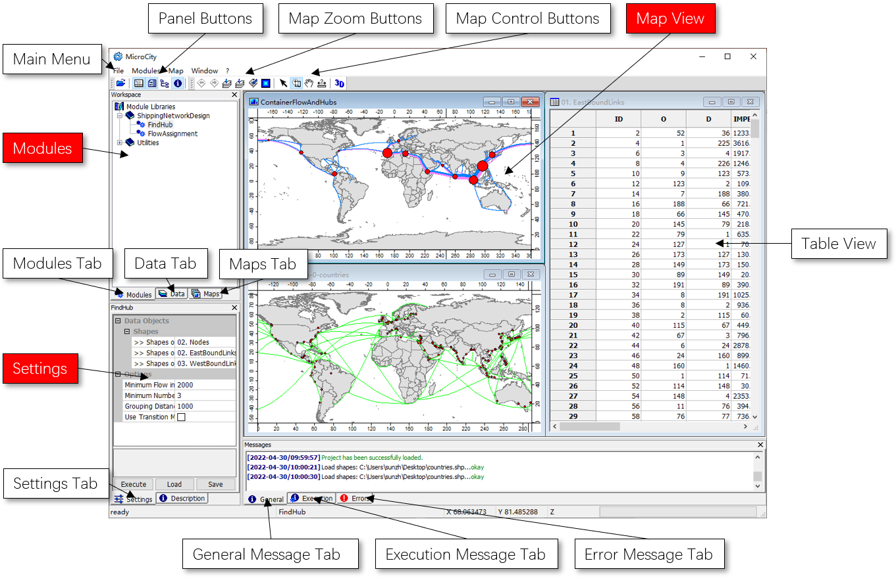

# 3.1 User Interfaces Overview
MicroCity provides a concise graphic windowed interface to facilitate the manipulation of data and modules. 
## The Main Window and Its Panels

## Supported Files
## Project Management
