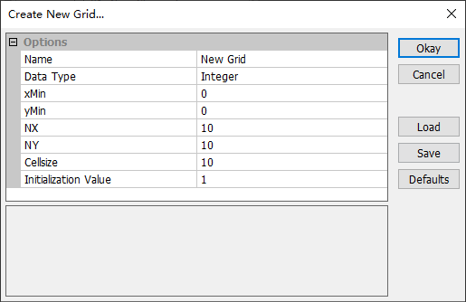
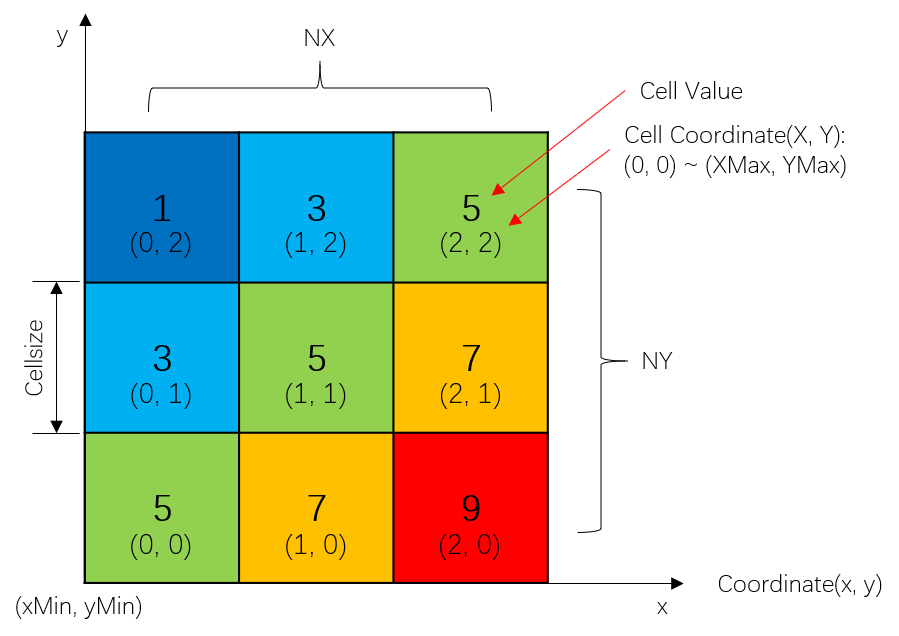
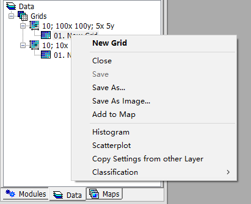

# 3.3 Raster Grids
MicroCity can open, create and edit SAGA Grid (\*.sgrd) which is called **Grid** and maintained in the **Data** Tab of the **Workspace** Panel. Image files (\*.bmp, \*.gif, \*.jpg, \*.png, \*.tif, \*.pcx) can be opened as **Grid** as well. By using **modules** (see [3.7](3.7_modules.md)) other raster file formats, such like ESRI Arc/Info Grid (\*.adf) and Surfer Grid (\*.grd), can also be imported or exported.
## Opening, Creating, Saving and Closing Grids
Users can click **Load** button  or **File->Grid->Load** menu item to open a **Grid**. Creating new **Grid** can be done from menu **File->Grid->New** and the pop-up dialog:

 
The above right figure is the data structure and definitions of a Grid. A Grid starts from its bottom left corner which has coordinate **(xMin, yMin)**, contains **NX*NY Square Cells**. Each cell has its own **Integer Coordinate** (X, Y), in the range of (0, 0) to (XMax, YMax).

Saving **Grid** can be done from the right click context menu **Save or Save As**. You can also close a **Grid** from the menu and get a prompt dialog to save it.

 

## Showing and Editing Grids
Double click a **Grid** from the **Data** Tab will give you a map view (for maps and layers see [3.6](3.6_maps_and_layers.md)). Toggle **Action** botton  and select a range of cells in a **Grid**. Then the value of these cells can be edited in the **Attributes** Tab of the **Settings** Panel.

 

## Display Settings and 3D View
Users can show cell values, change color and set transparency of a **Grid** by using **Settings** Panel. Using 3D  button can creat a 3D surface of a **Grid** in which cell values are translated to elevation (see [3.6](3.6_maps_and_layers.md#controlling-map-views)).

[**< 3.2 Vector Shapes**](3.2_vector_shapes.md) | [**Table of Contents**](.) | [**3.4 3D Scenes >**](3.4_3d_scenes.md)
