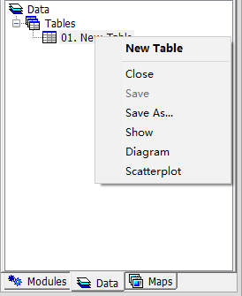

# 3.5 Tables
Tabular files including dBase files (\*.dbf), Text file (\*.txt) and Comma Separated Values (\*.csv) can be opened as **Table** and saved with MicroCity.
## Opening, Creating, Saving and Closing Grids
Users can click **Load** button  or **File->Table->Load** menu item to open a tabular file. Creating a new **Table** can be done from menu **File->Table->New** and the pop-up dialog as shown below. Saving a **Table** can be done from the right click context menu **Save or Save As**.

 
## Showing and Editing Tables
Double click a **Table** from the **Data** Tab will give you a table view. Altering a table's stucture can be done by right click the table's head. If you click "Add Field" then, a dialog which guide you (as shown below). If you want insert a record to the table, you can right click the left numbers of the table and select a context menu item. 

 

[**< 3.4 3D Scenes**](3.4_3d_scenes.md) | [**Table of Contents**](.) | [**3.6 Maps and Layers >**](3.6_maps_and_layers.md)
