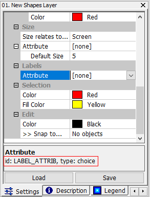

# 4.2 User Interfaces Control
Microcity Script can be used to control some features appearing in user interfaces, which include moduels, data objects, messages and so on. There are some sample codes can be found in the "user_interface" folder of the **Project** Tab in **ScriptEditor**.
## Basic User Interfaces
```lua
Print ("hello" [,...])
```
Prints values in the *Messages Panel*. 
```lua
Note ("hello" [,...])
```
Notifies users and pauses the execution.
```lua
SetProcessText ("processing")
```
Sets a text at the bottom left corner of *MicroCity*.
```lua
SetProgress (position, range)
```
Sets the progress bar of *position/range* that locates at the bottom right conner of *MicroCity*. 
```lua
Sleep (milliseconds)
```
Pauses the execution for *milliseconds*.
```lua
GetReady ()
```
Returns false if user cancel the current execution.
```lua
GetClickXY ()
```
Returns x,y where a user clicked at a *Map View*.
```lua
GetDragExtent ()
```
Returns bottom-left and top-right corner coordinate: Lx, By, Rx, Ty, which a user used mouse to drag a rectangle in a *Map View*.

## Data Objects
```lua
PATH
```
Internal global variable that holds a string of current working directory, such as "c:\microcity".
```lua
Open (".\\shapes.shp" [, ".\\grid.sgrd" [, ".\\table.dbf" [, ".\\scene.m3d" , ...]]])
```
Opens and returns *Shapes*, *Table*, *Grid* and *Scene* object from current working directory or opened data.
```lua
Close (Shapes|Grid|Table|Scene|Network|RndEngine|LPModel)
```
Closes an opened or created *Shapes*, *Table*, *Grid*, *Scene*, *Network*, *RndEngine* or *LPModel* object.
```lua
Update (Shapes|Grid|Table [, bShow = ture])
```
Update current changes of *Shapes*, *Grid* or *Table* object in *MicroCity*. The *bShow* indicates whether to create a view of the object. Returns false if user cancel the current execution.
```lua
CreateMap ("name", Shapes1|Grid1 [, Shapes2|Grid2, ...])
```
Creates a *Map View* to show objects which can be arranged in layers by their order in the parameters.

## Modules and Parameters
```lua
AddModule ("Function" [, "name"]) 
```
This function can add a lua function as a module to current module library. The module's default name is the function's name. Returns a *Module* object. 

```lua
AddParameter (Module, ParentNode, "Node",   "id")
AddParameter (Module, ParentNode, "Value", "id" [, default = 0])
AddParameter (Module, ParentNode, "Range",  "id" [, low = 0 [,  high = 1]])
AddParameter (Module, ParentNode, "Check",  "id" [, default = 0])
AddParameter (Module, ParentNode, "String", "id" [, "string" = "")
AddParameter (Module, ParentNode, "Choice", "id" , "choice1|choice2|" [, choice = 1])
AddParameter (Module, ParentNode, "File",   "id" [, "c:\\default.txt" = ""])
AddParameter (Module, ParentNode, "Color",  "id" [, "color" = "255 255 255")
AddParameter (Module, ParentNode, "Shapes", "id")
AddParameter (Module, ParentNode, "Grid",   "id")
AddParameter (Module, ParentNode, "Scene",  "id")
AddParameter (Module, ParentNode, "Table",  "id")
AddParameter (Module, ParentNode, "Field",  "id")
```
These functions can add a parameter to a module's settings panel. Returns corresponding values or an object. The *ParentNode* can be set to the first return of a *AddParameter* function. If *"Field"* is set at the third place, the *parent_node* can be set to a *Table* or *Shapes* object to get its attributes table's head.

```lua
GetParameter (Shapes|Table|Grid|Scene|Module, "id")
```
Returns the parameter specified by *"id"* from the object's settings panel.
```lua
SetParameter (Shapes|Table|Grid|Scene|Module, "id", Number|"String"|Object)
```
Sets the parameter specified by *"id"* in the object's settings panel. Returns *true* if succeed. Note that the choice parameter should start from 1. A parameter's *"id"* can be found in the parameter's helper text shown as below.



[**< 4.1 SI Overview**](4.1_si_overview.md) | [**Table of Contents**](.) | [**4.3 Shapes and Tables >**](4.3_shapes_and_tables.md)
