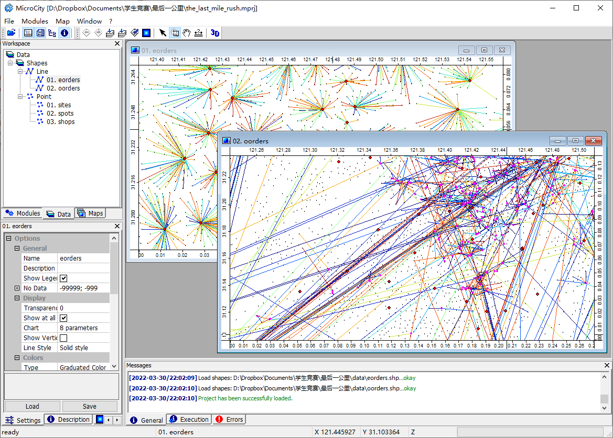
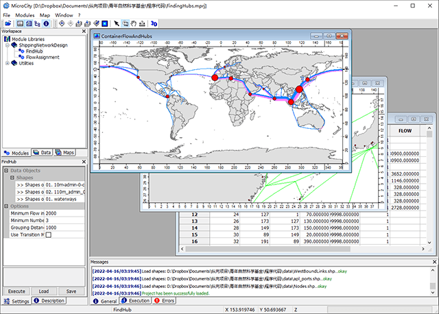

# What MicroCity can Do
Based on GIS, Networks and Optimization libraries, MicroCity can be used as a modeling tool to solve planning problems, such as **City Logistics:**

and **Shipping Planning:**

and 3DCGI technologies, MicroCity provides spatial graphics, networks, optimization and simulation modeling and algorithm tools, and a flexible scripting engine provides programming interfaces for secondary development. At present, commercial software in this field is dominated by European and American commercial software, which are expensive and uncontrollable. This software provides a zero-cost, lightweight, efficient and scalable platform for teaching and research, filling the gaps in related international fields. Teaching and scientific research such as: transportation planning, logistics and supply chain optimization, automated warehouse and dock simulation, etc. have been widely used. 

